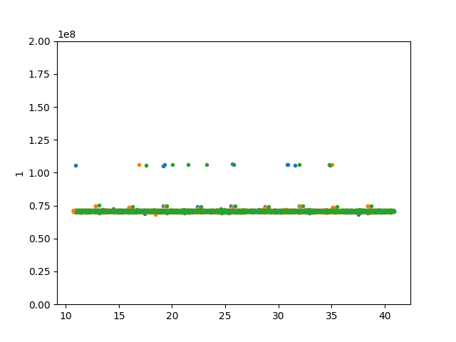
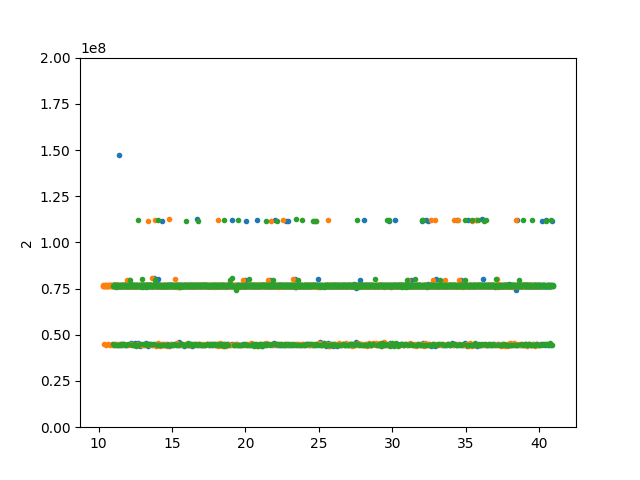

The Seagate Barracuda 5400 RPM drive seems to show vibration the best (compared
to the WD drives). We use this drive to compare across tests.

The each measurements is aligned along the `random` data column, so that the
same sequence of random reads/writes is compared to the identical sequence.
Then, we construct a histogram with 100 bins, and see which ones have unusally
high counts that are not the interval with 0 (where we expect most measurements
to lie). We see that rand-write has more bins being seen with high counts, and
has them for all 45Hz vibration series. Note that the counts for rand-read will
be higher in general, as the sampling rate is greater with reads. This indicates
that while both are impacted by vibration, writing shows the effects more.
```
bins for rand-read:
	 sg_barr-rand-read-none2_1.csv
		 157 from -1505019.026666671 to -98449.5
	 sg_barr-rand-read-none2_3.csv
	 sg_barr-rand-read-none2_2.csv
	 sg_barr-rand-read-none3_3.csv
		 1338 from -4238931.239999995 to -16169.25
	 sg_barr-rand-read-none3_2.csv
		 1348 from 15567.333333328366 to 4237803.626666665
	 sg_barr-rand-read-none3_1.csv
	 sg_barr-rand-read-45Hz-7.6mmps_2.csv
		 770 from -4266455.040000007 to -43509.666666671634
	 sg_barr-rand-read-45Hz-7.6mmps_3.csv
		 575 from 53803.166666671634 to 4275500.546666667
	 sg_barr-rand-read-45Hz-7.6mmps_1.csv

bins for rand-write:
	 sg_barr-rand-write-none2_2.csv
		 224 from -4408987.600000009 to -139461.7500000149
	 sg_barr-rand-write-none2_3.csv
	 sg_barr-rand-write-none2_1.csv
	 sg_barr-rand-write-none3_3.csv
	 sg_barr-rand-write-none3_1.csv
	 sg_barr-rand-write-none3_2.csv
	 sg_barr-rand-write-15Hz-7.6mmps_1.csv
		 80 from -4015897.8200000077 to -472479.40000000596
	 sg_barr-rand-write-15Hz-7.6mmps_2.csv
		 80 from -4768846.11999999 to -487353.58333332837
	 sg_barr-rand-write-15Hz-7.6mmps_3.csv
	 sg_barr-rand-write-30Hz-7.6mmps_3.csv
		 38 from -4031731.670000002 to -495264.90000000596
	 sg_barr-rand-write-30Hz-7.6mmps_2.csv
		 295 from -4317603.439999998 to -47372.4999999851
	 sg_barr-rand-write-30Hz-7.6mmps_1.csv
	 sg_barr-rand-write-45Hz-7.6mmps_2.csv
		 101 from -7481990.513333321 to -388109.549999997
		 35 from 27987414.303333342 to 35081295.26666668
		 91 from 35081295.26666668 to 42175176.23000002
	 sg_barr-rand-write-45Hz-7.6mmps_1.csv
		 28 from 42463915.5 to 92258973.0
	 sg_barr-rand-write-45Hz-7.6mmps_3.csv
		 147 from 13326899.766666666 to 73714129.65
```

Below we plot rand-write with and without vibration:


and to compare with sequential, below are the plot for seq-write with and
without vibration:




From this, it seems obvious that random seeking shows vibration better. We also
consider reading from the 0 position on the disk, and below plot the before and
after.


Again, from this, the random seeking plots show vibration much clearer.

We analyze these showing 45 Hz, as at this frequency the plots clearly show
effects of vibration for random-write. 

To justify using a real time operating system, we compare the data with no
vibration collected on a standard Lubuntu installation vs. to Xubuntu with the
preempt RT linux patch. Calculating the histogram as above using data collected
from the standard Xubuntu installation, we get:
```
bins compared to preempt RT no vibration:
	 sg_barr-rand-write-none-RT_2.csv
	 sg_barr-rand-write-none-RT_3.csv
	 sg_barr-rand-write-none-RT_1.csv
		 272 from -3974728.9333333373 to -280677.96666666865
	 sg_barr-rand-write-none_1.csv
		 603 from -1445188.5066666752 to -18753.0
	 sg_barr-rand-write-none_2.csv
		 111 from -5158187.6400000155 to -879934.9166666865
	 sg_barr-rand-write-none_3.csv
		 31 from -2825777.056666672 to -1401763.153333336
		 634 from 22250.75 to 1446264.653333336
```
and from this we see that there is a difference in the two data sets. For the RT
linux series, we run the program using the FIFO scheduler with a priority of 99.
See more documentation on this
[here](https://wiki.linuxfoundation.org/realtime/documentation/technical_basics/sched_policy_prio/start).
Since a RT operating system should reduce noise overall, or at least add
operating system noise in a way that is deterministic, we use it anyway.

We consider a sequence of positions that is made to maximize seeking. First, we
crafted a program that iterates between various jump sizes (i.e. sends jobs to
the disks at position 0, 1, 0, 2, 0, 3, 0, 4...). From this, we look for
consistent behavior. We find a jump size that is large, that causes high
latency. We also run this sequence again at a higher offset, to see if the size
of jump is correlated with latency, which appears this is not the case. The same
jump size only caused measurements within 10% of the original measurement 55% of
the time. 

One value that caused a large latency (above average) is taken and used as a
jump step. For example, the jump N generates the sequence 0, N, 2N, 3N, ...
which is then used instead of random seeking. When the data from this is plotted
with and without vibration, the following plots result:




From this, we can see vibration more clearly than with always seeking to 0. This
method also has the highest mean of any of the methods tried, giving 71584022
with no vibration compared to 65775531 with random seeking. When using the
alignment and histogram method, this method yields more false positives than
random seeking. The statistical tests also show the mean when introducing
vibration is less than with random seeking (from 71584022 to 72187862 compared 
to from 65775531 to 93744709). These plots are similar to the sequential seeking
method, but vibration is shown clearer.

One advantage of this method is that it can be used easily in real time by
keeping track of a rolling average.


TODO:
- Raw file system justification
- Sideways justification
- Other disks?

